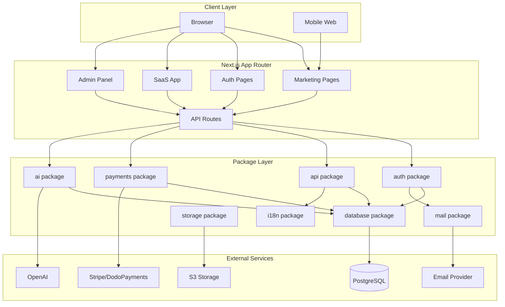
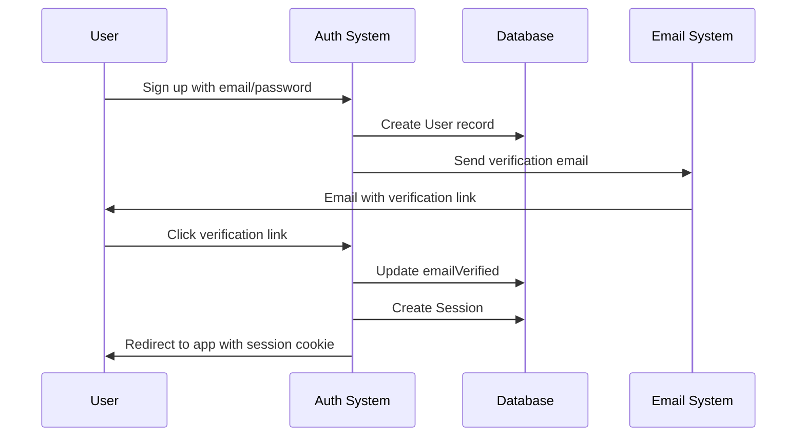
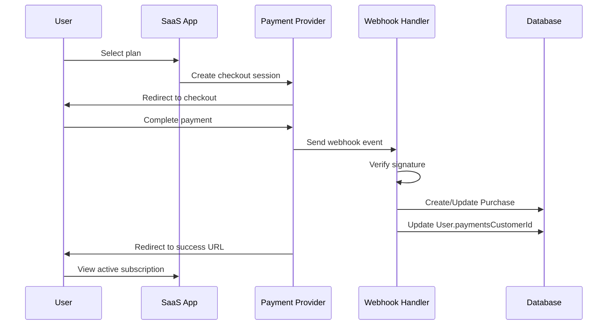
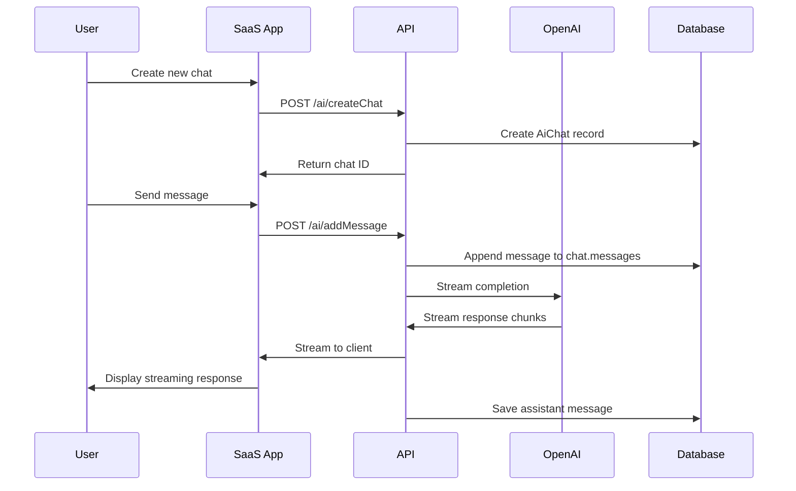

# Design Document

## Overview

This design document outlines the architecture and implementation approach for a production-ready SaaS starter kit. The system is built on a monorepo architecture using Next.js 15 App Router, React 19, and TypeScript, with a focus on modularity, type safety, and developer experience.

### Key Design Principles

1. **Modularity**: Separate concerns into focused packages that can be developed and tested independently
2. **Type Safety**: Leverage TypeScript strict mode and code generation for end-to-end type safety
3. **Developer Experience**: Optimize for fast feedback loops with hot reload, caching, and clear error messages
4. **Security First**: Implement security best practices at every layer
5. **Scalability**: Design for growth with proper abstractions and separation of concerns
6. **Flexibility**: Use configuration and feature flags to enable/disable features without code changes

## Architecture

### High-Level Architecture



```

### Monorepo Structure

```

saas-starter-kit/
├── apps/
│ └── web/ # Next.js 15 application
│ ├── app/ # App Router pages
│ ├── components/ # React components
│ ├── lib/ # App-specific utilities
│ └── tests/ # Playwright E2E tests
├── packages/
│ ├── ai/ # AI integration (OpenAI SDK)
│ ├── api/ # ORPC API definitions
│ ├── auth/ # better-auth configuration
│ ├── database/ # Prisma schema and client
│ ├── i18n/ # Internationalization
│ ├── logs/ # Logging utilities
│ ├── mail/ # Email templates and provider
│ ├── payments/ # Payment provider abstraction
│ ├── storage/ # S3 storage abstraction
│ └── utils/ # Shared utilities
├── config/ # Application configuration
└── tooling/ # Shared tooling configs
├── biome/ # Biome config
├── tailwind/ # Tailwind config
└── typescript/ # TypeScript configs

````

## Components and Interfaces

### 1. Authentication System (packages/auth)

**Design Decision**: Use better-auth v1.3.7 as the foundation because it provides:
- Built-in support for multiple auth methods (email/password, magic link, OAuth, passkeys, 2FA)
- Prisma adapter for seamless database integration
- Session management with configurable expiration
- Plugin architecture for extensibility

**Architecture**:

```typescript
// packages/auth/index.ts
export const auth = betterAuth({
  database: prismaAdapter(prisma),
  emailAndPassword: { enabled: true },
  magicLink: { enabled: config.auth.enableMagicLink },
  socialProviders: {
    google: { enabled: config.auth.enableSocialLogin },
    github: { enabled: config.auth.enableSocialLogin }
  },
  passkey: { enabled: config.auth.enablePasskeys },
  twoFactor: { enabled: config.auth.enableTwoFactor },
  session: {
    cookieMaxAge: config.auth.sessionCookieMaxAge,
    updateAge: 24 * 60 * 60 // Update session every 24 hours
  }
})
````

**Key Interfaces**:

```typescript
interface AuthSession {
	user: {
		id: string;
		email: string;
		name: string;
		role?: string;
		locale?: string;
	};
	session: {
		id: string;
		expiresAt: Date;
	};
}

interface AuthHooks {
	onSignUp?: (user: User) => Promise<void>;
	onEmailVerified?: (user: User) => Promise<void>;
	onAccountDelete?: (userId: string) => Promise<void>;
}
```

**Custom Plugins**:

1. **Subscription Cancellation Hook**: Cancel active subscriptions when user deletes account
2. **Locale-Aware Emails**: Send emails in user's preferred locale
3. **Invitation-Only Mode**: Restrict signup to invited users when signup is disabled

### 2. Database Layer (packages/database)

**Design Decision**: Use Prisma ORM for:

- Type-safe database queries
- Automatic migration generation
- Schema-first development
- Zod schema generation for validation

**Schema Organization**:

```prisma
// Core authentication models
model User {
  id                  String    @id @default(cuid())
  name                String
  email               String    @unique
  emailVerified       DateTime?
  image               String?
  username            String?   @unique
  role                String?
  banned              Boolean   @default(false)
  banReason           String?
  banExpires          DateTime?
  onboardingComplete  Boolean   @default(false)
  paymentsCustomerId  String?
  locale              String?
  twoFactorEnabled    Boolean   @default(false)
  createdAt           DateTime  @default(now())
  updatedAt           DateTime  @updatedAt

  // Relations
  sessions            Session[]
  accounts            Account[]
  passkeys            Passkey[]
  twoFactor           TwoFactor?
  purchases           Purchase[]
  aiChats             AiChat[]
}

// Payment models
model Purchase {
  id              String   @id @default(cuid())
  userId          String?
  type            PurchaseType
  customerId      String
  subscriptionId  String?  @unique
  productId       String
  status          String?
  createdAt       DateTime @default(now())
  updatedAt       DateTime @updatedAt

  user            User?    @relation(fields: [userId], references: [id], onDelete: Cascade)

  @@index([subscriptionId])
}

enum PurchaseType {
  SUBSCRIPTION
  ONE_TIME
}

// AI models
model AiChat {
  id        String   @id @default(cuid())
  userId    String?
  title     String?
  messages  Json     @default("[]")
  createdAt DateTime @default(now())
  updatedAt DateTime @updatedAt

  user      User?    @relation(fields: [userId], references: [id], onDelete: Cascade)
}
```

**Database Client Abstraction**:

```typescript
// packages/database/client.ts
export const db = prisma;

// Type-safe query helpers
export const queries = {
	user: {
		findByEmail: (email: string) => db.user.findUnique({ where: { email } }),
		findById: (id: string) => db.user.findUnique({ where: { id } }),
		updateLocale: (id: string, locale: string) =>
			db.user.update({ where: { id }, data: { locale } }),
	},
	purchase: {
		findActiveSubscription: (userId: string) =>
			db.purchase.findFirst({
				where: { userId, type: 'SUBSCRIPTION', status: 'active' },
			}),
	},
};
```

### 3. Payment System (packages/payments)

**Design Decision**: Create a unified payment provider interface to support multiple providers (Stripe and DodoPayments) without coupling the application to a specific provider.

**Provider Interface**:

```typescript
interface PaymentProvider {
	// Checkout
	createCheckoutSession(params: {
		customerId?: string;
		productId: string;
		successUrl: string;
		cancelUrl: string;
		metadata?: Record<string, string>;
	}): Promise<{ url: string }>;

	// Customer portal
	createCustomerPortalLink(params: {
		customerId: string;
		returnUrl: string;
	}): Promise<{ url: string }>;

	// Subscription management
	cancelSubscription(subscriptionId: string): Promise<void>;
	updateSubscription(
		subscriptionId: string,
		params: {
			productId?: string;
			quantity?: number;
		}
	): Promise<void>;

	// Webhook verification
	verifyWebhookSignature(params: {
		payload: string | Buffer;
		headers: Record<string, string>;
	}): Promise<boolean>;

	// Webhook event parsing
	parseWebhookEvent(payload: string | Buffer): Promise<WebhookEvent>;
}

interface WebhookEvent {
	type:
		| 'checkout.completed'
		| 'subscription.created'
		| 'subscription.updated'
		| 'subscription.cancelled';
	data: {
		customerId: string;
		subscriptionId?: string;
		productId: string;
		status?: string;
		metadata?: Record<string, string>;
	};
}
```

**Provider Implementations**:

1. **Stripe Provider** (`packages/payments/providers/stripe.ts`):

   - Use official Stripe SDK
   - Verify signatures using `stripe-signature` header
   - Map Stripe events to unified WebhookEvent format

2. **DodoPayments Provider** (`packages/payments/providers/dodo.ts`):
   - Use DodoPayments SDK
   - Verify HMAC SHA256 signatures using webhook-id, webhook-signature, webhook-timestamp
   - Map DodoPayments events to unified WebhookEvent format

**Provider Selection**:

```typescript
// packages/payments/index.ts
export function getPaymentProvider(): PaymentProvider {
	const provider = process.env.PAYMENT_PROVIDER || 'stripe';

	switch (provider) {
		case 'stripe':
			return new StripeProvider();
		case 'dodo':
			return new DodoPaymentsProvider();
		default:
			throw new Error(`Unknown payment provider: ${provider}`);
	}
}
```

### 4. API Layer (packages/api)

**Design Decision**: Use ORPC for type-safe API routes because it provides:

- Full TypeScript inference from server to client
- OpenAPI schema generation
- Middleware support for authentication
- Zod validation integration

**API Architecture**:

```typescript
// packages/api/index.ts
import { createORPC } from '@orpc/server';

// Base procedure (public)
export const publicProcedure = createORPC();

// Protected procedure (requires authentication)
export const protectedProcedure = publicProcedure.use(async (ctx, next) => {
	const session = await auth.getSession(ctx.req);
	if (!session) throw new Error('Unauthorized');
	return next({ ...ctx, user: session.user });
});

// Admin procedure (requires admin role)
export const adminProcedure = protectedProcedure.use(async (ctx, next) => {
	if (ctx.user.role !== 'admin') throw new Error('Forbidden');
	return next(ctx);
});
```

**Module Structure**:

Each API module exports a router with related procedures:

```typescript
// packages/api/modules/ai/index.ts
export const aiRouter = {
	createChat: protectedProcedure
		.input(z.object({ title: z.string().optional() }))
		.mutation(async ({ input, ctx }) => {
			return db.aiChat.create({
				data: { userId: ctx.user.id, title: input.title },
			});
		}),

	listChats: protectedProcedure.query(async ({ ctx }) => {
		return db.aiChat.findMany({
			where: { userId: ctx.user.id },
			orderBy: { updatedAt: 'desc' },
		});
	}),

	// ... more procedures
};
```

**API Modules**:

1. **admin**: User and organization management (admin only)
2. **ai**: Chat operations (create, list, update, delete, add message)
3. **contact**: Contact form submission
4. **newsletter**: Newsletter subscription
5. **payments**: Checkout, customer portal, purchase listing
6. **users**: Avatar upload, user management

### 5. AI Integration (packages/ai)

**Design Decision**: Use OpenAI SDK with AI SDK for streaming responses.

**AI Service Architecture**:

```typescript
// packages/ai/index.ts
import OpenAI from 'openai';
import { streamText } from 'ai';

export const openai = new OpenAI({
	apiKey: process.env.OPENAI_API_KEY,
});

export async function generateChatResponse(messages: Message[]) {
	return streamText({
		model: openai('gpt-4o-mini'),
		messages,
	});
}

export async function generateImage(prompt: string) {
	return openai.images.generate({
		model: 'dall-e-3',
		prompt,
		n: 1,
		size: '1024x1024',
	});
}

export async function transcribeAudio(file: File) {
	return openai.audio.transcriptions.create({
		model: 'whisper-1',
		file,
	});
}
```

**Chat Message Storage**:

Messages are stored as JSON array in the `AiChat.messages` field:

```typescript
interface ChatMessage {
	id: string;
	role: 'user' | 'assistant' | 'system';
	content: string;
	createdAt: string;
}
```

### 6. Email System (packages/mail)

**Design Decision**: Use React Email for templates and abstract the email provider for flexibility.

**Email Provider Interface**:

```typescript
interface EmailProvider {
	send(params: {
		to: string;
		subject: string;
		html: string;
		from?: string;
	}): Promise<void>;
}

// packages/mail/provider.ts
export function getEmailProvider(): EmailProvider {
	const provider = process.env.EMAIL_PROVIDER || 'plunk';
	// Return appropriate provider implementation
}
```

**Email Templates**:

Each template is a React component that renders to HTML:

```typescript
// packages/mail/templates/EmailVerification.tsx
interface EmailVerificationProps {
	name: string;
	verificationUrl: string;
	locale: string;
}

export function EmailVerification({
	name,
	verificationUrl,
	locale,
}: EmailVerificationProps) {
	const t = getTranslations(locale);

	return (
		<Html>
			<Head />
			<Body>
				<Container>
					<Heading>{t('email.verification.title')}</Heading>
					<Text>{t('email.verification.greeting', { name })}</Text>
					<Button href={verificationUrl}>
						{t('email.verification.button')}
					</Button>
				</Container>
			</Body>
		</Html>
	);
}
```

**Email Sending Service**:

```typescript
// packages/mail/index.ts
export async function sendEmail(template: EmailTemplate, props: any) {
	const html = render(template(props));
	const provider = getEmailProvider();

	await provider.send({
		to: props.to,
		subject: props.subject,
		html,
		from: config.mails.from,
	});
}
```

### 7. Storage System (packages/storage)

**Design Decision**: Use S3-compatible storage with presigned URLs for secure file access.

**Storage Interface**:

```typescript
interface StorageProvider {
	getUploadUrl(params: {
		bucket: string;
		key: string;
		expiresIn?: number;
	}): Promise<{ url: string }>;

	getDownloadUrl(params: {
		bucket: string;
		key: string;
		expiresIn?: number;
	}): Promise<{ url: string }>;

	deleteObject(params: { bucket: string; key: string }): Promise<void>;
}
```

**S3 Implementation**:

```typescript
// packages/storage/providers/s3.ts
import {
	S3Client,
	PutObjectCommand,
	GetObjectCommand,
} from '@aws-sdk/client-s3';
import { getSignedUrl } from '@aws-sdk/s3-request-presigner';

export class S3StorageProvider implements StorageProvider {
	private client: S3Client;

	constructor() {
		this.client = new S3Client({
			endpoint: process.env.S3_ENDPOINT,
			region: process.env.S3_REGION || 'auto',
			credentials: {
				accessKeyId: process.env.S3_ACCESS_KEY_ID!,
				secretAccessKey: process.env.S3_SECRET_ACCESS_KEY!,
			},
		});
	}

	async getUploadUrl({ bucket, key, expiresIn = 60 }) {
		const command = new PutObjectCommand({ Bucket: bucket, Key: key });
		const url = await getSignedUrl(this.client, command, { expiresIn });
		return { url };
	}

	async getDownloadUrl({ bucket, key, expiresIn = 3600 }) {
		const command = new GetObjectCommand({ Bucket: bucket, Key: key });
		const url = await getSignedUrl(this.client, command, { expiresIn });
		return { url };
	}
}
```

**Avatar Upload Flow**:

1. Client requests upload URL from API
2. API generates presigned PUT URL (60s expiration)
3. Client uploads directly to S3 using presigned URL
4. Client sends S3 key to API to update user.image
5. Images are served through image proxy endpoint for security

### 8. Internationalization (packages/i18n)

**Design Decision**: Use next-intl for comprehensive i18n support with type safety.

**i18n Configuration**:

```typescript
// packages/i18n/config.ts
export const locales = ['en', 'de'] as const;
export type Locale = (typeof locales)[number];

export const defaultLocale: Locale = 'en';

export const localeConfig = {
	en: { label: 'English', currency: 'USD' },
	de: { label: 'Deutsch', currency: 'USD' },
};
```

**Translation Structure**:

```json
// packages/i18n/translations/en.json
{
	"auth": {
		"login": {
			"title": "Sign in to your account",
			"email": "Email address",
			"password": "Password",
			"submit": "Sign in"
		},
		"signup": {
			"title": "Create your account",
			"submit": "Sign up"
		}
	},
	"app": {
		"dashboard": {
			"title": "Dashboard",
			"welcome": "Welcome back, {name}"
		}
	}
}
```

**Type-Safe Translations**:

```typescript
// packages/i18n/index.ts
import { useTranslations } from 'next-intl';

export function useTypedTranslations() {
	return useTranslations();
}

// Usage in components
const t = useTypedTranslations();
t('auth.login.title'); // Type-safe, autocomplete works
```

**Locale Detection and Storage**:

1. Check NEXT_LOCALE cookie
2. Fall back to Accept-Language header
3. Fall back to default locale (en)
4. Store selected locale in cookie for persistence

### 9. UI Component System

**Design Decision**: Use Shadcn UI + Radix UI for accessible, customizable components with Tailwind CSS.

**Component Architecture**:

```typescript
// apps/web/components/ui/button.tsx
import { Slot } from '@radix-ui/react-slot';
import { cva, type VariantProps } from 'class-variance-authority';

const buttonVariants = cva(
	'inline-flex items-center justify-center rounded-md text-sm font-medium transition-colors',
	{
		variants: {
			variant: {
				default: 'bg-primary text-primary-foreground hover:bg-primary/90',
				destructive:
					'bg-destructive text-destructive-foreground hover:bg-destructive/90',
				outline: 'border border-input bg-background hover:bg-accent',
				ghost: 'hover:bg-accent hover:text-accent-foreground',
			},
			size: {
				default: 'h-10 px-4 py-2',
				sm: 'h-9 rounded-md px-3',
				lg: 'h-11 rounded-md px-8',
			},
		},
		defaultVariants: {
			variant: 'default',
			size: 'default',
		},
	}
);

export interface ButtonProps
	extends React.ButtonHTMLAttributes<HTMLButtonElement>,
		VariantProps<typeof buttonVariants> {
	asChild?: boolean;
}

export function Button({
	className,
	variant,
	size,
	asChild = false,
	...props
}: ButtonProps) {
	const Comp = asChild ? Slot : 'button';
	return (
		<Comp
			className={cn(buttonVariants({ variant, size, className }))}
			{...props}
		/>
	);
}
```

**Theme System**:

```css
/* tooling/tailwind/theme.css */
@layer base {
	:root {
		--background: 0 0% 100%;
		--foreground: 222.2 84% 4.9%;
		--primary: 222.2 47.4% 11.2%;
		--primary-foreground: 210 40% 98%;
		/* ... more variables */
	}

	.dark {
		--background: 222.2 84% 4.9%;
		--foreground: 210 40% 98%;
		--primary: 210 40% 98%;
		--primary-foreground: 222.2 47.4% 11.2%;
		/* ... more variables */
	}
}
```

**Theme Provider**:

```typescript
// apps/web/components/theme-provider.tsx
export function ThemeProvider({ children }: { children: React.ReactNode }) {
	const [theme, setTheme] = useState<'light' | 'dark'>('light');

	useEffect(() => {
		const stored = localStorage.getItem('theme');
		if (stored) setTheme(stored as 'light' | 'dark');
	}, []);

	useEffect(() => {
		document.documentElement.classList.toggle('dark', theme === 'dark');
		localStorage.setItem('theme', theme);
	}, [theme]);

	return (
		<ThemeContext.Provider value={{ theme, setTheme }}>
			{children}
		</ThemeContext.Provider>
	);
}
```

### 10. Configuration System

**Design Decision**: Centralize all feature flags and configuration in a single file for easy management.

**Configuration Structure**:

```typescript
// config/index.ts
export const config = {
	appName: 'SaaS Starter Kit',

	i18n: {
		enabled: true,
		locales: {
			en: { currency: 'USD', label: 'English' },
			de: { currency: 'USD', label: 'Deutsch' },
		},
		defaultLocale: 'en',
		defaultCurrency: 'USD',
		localeCookieName: 'NEXT_LOCALE',
	},

	users: {
		enableBilling: true,
		enableOnboarding: true,
	},

	auth: {
		enableSignup: true,
		enableMagicLink: true,
		enableSocialLogin: true,
		enablePasskeys: true,
		enablePasswordLogin: true,
		enableTwoFactor: true,
		redirectAfterSignIn: '/app',
		redirectAfterLogout: '/',
		sessionCookieMaxAge: 30 * 24 * 60 * 60, // 30 days
	},

	mails: {
		from: 'noreply@example.com',
	},

	storage: {
		bucketNames: {
			avatars: process.env.NEXT_PUBLIC_AVATARS_BUCKET_NAME || 'avatars',
		},
	},

	ui: {
		enabledThemes: ['light', 'dark'] as const,
		defaultTheme: 'light' as const,
		saas: {
			enabled: true,
			useSidebarLayout: true,
		},
		marketing: {
			enabled: true,
		},
	},

	contactForm: {
		enabled: true,
		to: 'contact@example.com',
		subject: 'New Contact Form Submission',
	},

	payments: {
		plans: {
			free: {
				isFree: true,
				prices: [],
			},
			pro: {
				recommended: true,
				prices: [
					{
						productId: 'price_pro_monthly',
						amount: 2900,
						currency: 'USD',
						type: 'recurring',
						interval: 'month',
						trialPeriodDays: 14,
					},
					{
						productId: 'price_pro_yearly',
						amount: 29000,
						currency: 'USD',
						type: 'recurring',
						interval: 'year',
					},
				],
			},
			lifetime: {
				prices: [
					{
						productId: 'price_lifetime',
						amount: 99900,
						currency: 'USD',
						type: 'one-time',
					},
				],
			},
			enterprise: {
				isEnterprise: true,
				prices: [],
			},
		},
	},
} as const;
```

## Data Models

### User Data Flow



### Payment Data Flow



### AI Chat Data Flow



## Error Handling

### Error Handling Strategy

1. **API Errors**: Use ORPC error handling with proper HTTP status codes
2. **Database Errors**: Catch Prisma errors and map to user-friendly messages
3. **Payment Errors**: Log payment failures and notify admins
4. **Email Errors**: Queue failed emails for retry
5. **Validation Errors**: Use Zod for input validation with clear error messages

**Error Response Format**:

```typescript
interface ErrorResponse {
	error: {
		code: string;
		message: string;
		details?: Record<string, any>;
	};
}
```

**Error Codes**:

- `UNAUTHORIZED`: User not authenticated
- `FORBIDDEN`: User lacks required permissions
- `NOT_FOUND`: Resource not found
- `VALIDATION_ERROR`: Input validation failed
- `PAYMENT_ERROR`: Payment processing failed
- `INTERNAL_ERROR`: Unexpected server error

### Logging Strategy

```typescript
// packages/logs/index.ts
export const logger = {
	info: (message: string, meta?: Record<string, any>) => {
		console.log(
			JSON.stringify({ level: 'info', message, ...meta, timestamp: new Date() })
		);
	},
	error: (message: string, error?: Error, meta?: Record<string, any>) => {
		console.error(
			JSON.stringify({
				level: 'error',
				message,
				error: error?.message,
				stack: error?.stack,
				...meta,
				timestamp: new Date(),
			})
		);
	},
	warn: (message: string, meta?: Record<string, any>) => {
		console.warn(
			JSON.stringify({ level: 'warn', message, ...meta, timestamp: new Date() })
		);
	},
};
```

## Testing Strategy

### Testing Pyramid

1. **Unit Tests**: Test individual functions and utilities (not prioritized in initial implementation)
2. **Integration Tests**: Test API endpoints and database operations (not prioritized in initial implementation)
3. **E2E Tests**: Test critical user flows with Playwright

### E2E Test Coverage

**Critical Flows to Test**:

1. User signup and email verification
2. Login with email/password
3. Password reset flow
4. Plan selection and checkout (using test mode)
5. User settings update
6. AI chat creation and messaging
7. Admin user management

**Playwright Configuration**:

```typescript
// apps/web/playwright.config.ts
export default defineConfig({
	testDir: './tests',
	fullyParallel: true,
	forbidOnly: !!process.env.CI,
	retries: process.env.CI ? 2 : 0,
	workers: process.env.CI ? 1 : undefined,
	reporter: 'html',
	use: {
		baseURL: 'http://localhost:3000',
		trace: 'on-first-retry',
		video: 'retain-on-failure',
	},
	webServer: {
		command: 'pnpm build && pnpm start',
		url: 'http://localhost:3000',
		reuseExistingServer: !process.env.CI,
	},
});
```

### Test Example

```typescript
// apps/web/tests/home.spec.ts
import { test, expect } from '@playwright/test';

test('homepage loads successfully', async ({ page }) => {
	await page.goto('/');
	await expect(page).toHaveTitle(/SaaS Starter Kit/);
	await expect(page.locator('h1')).toBeVisible();
});
```

## Security Considerations

### Authentication Security

1. **Password Hashing**: better-auth handles password hashing with bcrypt
2. **Session Security**: HTTP-only, secure cookies with SameSite=Lax
3. **CSRF Protection**: Built into better-auth
4. **Rate Limiting**: Implement rate limiting on auth endpoints (future enhancement)

### Payment Security

1. **Webhook Signature Verification**: Always verify signatures before processing
2. **Idempotency**: Handle duplicate webhook events gracefully
3. **Metadata Validation**: Validate user_id in metadata matches authenticated user

### API Security

1. **Input Validation**: Zod schemas on all API inputs
2. **Authorization**: Check user permissions before operations
3. **SQL Injection**: Prisma ORM prevents SQL injection
4. **XSS Protection**: React escapes output by default

### File Upload Security

1. **Presigned URLs**: Time-limited upload URLs (60s)
2. **File Type Validation**: Validate file types on upload
3. **Size Limits**: Enforce file size limits
4. **Image Proxy**: Serve images through proxy to prevent direct S3 access

## Performance Considerations

### Optimization Strategies

1. **Database Indexing**: Index frequently queried fields (email, subscriptionId)
2. **Caching**: Use React Query for client-side caching
3. **Code Splitting**: Next.js automatic code splitting
4. **Image Optimization**: Next.js Image component for optimized images
5. **Turbo Caching**: Turborepo caches build outputs

### Monitoring

1. **Error Tracking**: Log errors with context for debugging
2. **Performance Metrics**: Monitor API response times (future enhancement)
3. **Database Queries**: Monitor slow queries (future enhancement)

## Deployment Considerations

### Environment Variables

Required environment variables:

```bash
# Database
DATABASE_URL=postgresql://...

# Authentication
BETTER_AUTH_SECRET=...
BETTER_AUTH_URL=https://yourdomain.com

# Payment Provider (choose one)
PAYMENT_PROVIDER=stripe # or 'dodo'
STRIPE_SECRET_KEY=sk_...
STRIPE_WEBHOOK_SECRET=whsec_...
# OR
DODO_PAYMENTS_API_KEY=...
DODO_PAYMENTS_WEBHOOK_SECRET=...

# OpenAI
OPENAI_API_KEY=sk-...

# Email Provider
EMAIL_PROVIDER=plunk # or other
EMAIL_API_KEY=...

# Storage
S3_ENDPOINT=https://...
S3_REGION=auto
S3_ACCESS_KEY_ID=...
S3_SECRET_ACCESS_KEY=...
NEXT_PUBLIC_AVATARS_BUCKET_NAME=avatars
```

### Build Process

1. Install dependencies: `pnpm install`
2. Generate Prisma client: `pnpm db:generate`
3. Run migrations: `pnpm db:migrate`
4. Build all packages: `pnpm build`
5. Start production server: `pnpm start`

### Deployment Platforms

Recommended platforms:

- **Vercel**: Optimal for Next.js, automatic deployments
- **Railway**: Easy PostgreSQL + app deployment
- **Fly.io**: Global edge deployment
- **AWS**: Full control, requires more setup

## Future Enhancements

### Phase 2 Features

1. **Organization/Team Support**: Multi-tenant architecture
2. **Advanced Analytics**: Usage tracking and dashboards
3. **API Rate Limiting**: Protect against abuse
4. **Audit Logs**: Track user actions for compliance
5. **Advanced AI Features**: Custom models, fine-tuning
6. **Mobile App**: React Native app using same API
7. **Webhooks**: Allow users to configure webhooks for events
8. **Advanced Permissions**: Role-based access control (RBAC)

### Scalability Improvements

1. **Database Read Replicas**: Separate read/write databases
2. **Redis Caching**: Cache frequently accessed data
3. **Queue System**: Background job processing
4. **CDN Integration**: Serve static assets from CDN
5. **Microservices**: Split into separate services if needed
